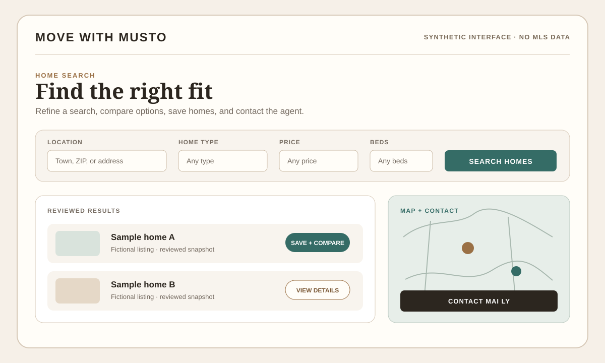
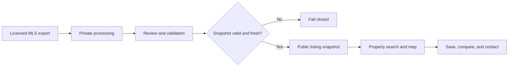

# Move With Musto

Case study of an independently designed, built, and maintained real-estate application for Move With Musto.

[Portfolio case study](https://renaldomusto.com/work/move-with-musto/) · [Review the source edition](https://github.com/ronmusto/move-with-musto-source)

> The [source edition](https://github.com/ronmusto/move-with-musto-source) is available for local evaluation under a restrictive license. It includes synthetic replacement assets and excludes production Git history, live MLS records, restricted imagery, credentials, and private operating material. The operational website is temporarily showing a brokerage-transition page; the case study and source provide the review path during that transition.

| Result | My scope | Verification |
| --- | --- | --- |
| An independently built real-estate application connecting responsive property discovery, reviewed listing snapshots, saved-home workflows, and direct contact paths | Full-stack delivery across product framing, responsive interfaces, data-publication controls, AWS deployment, and release checks | Targeted browser checks, snapshot validation, build safeguards, production routes, and rendered hosting behavior |

## Context

Move With Musto needed more than a marketing page. The product combines a real-estate agent's brand with a property-search workspace, saved and compared homes, contact workflows, reviewed listing data, and the operational safeguards required for a production real-estate site.

I independently designed, built, deployed, and maintained the application, including its responsive interface, data-publication controls, AWS delivery, and release verification.

## Product scope

- Responsive property search with URL-based filters
- List and map views across desktop and mobile layouts
- Browser-based saved and compared homes
- Buyer, seller, and property-specific contact workflows
- Reviewed MLS PIN listing snapshots
- Listing freshness and schema validation before publication
- Domain, legal, brand, and production-route checks
- AWS-hosted deployment and live verification

## Sanitized interface illustration

*Synthetic illustration of the implemented search, map, save, compare, and contact workflow. It contains no MLS listing data, listing photography, addresses, prices, or brokerage marks.*

## Publication path

## Key engineering decisions

### Fail closed when listing data cannot be trusted

The public property workspace does not silently serve malformed or stale data. Publication requires a reviewed snapshot that matches the expected schema and remains within a three-day freshness window.

### Preserve search state in the URL

Filters are represented in the URL so searches remain shareable, restorable, and compatible with browser navigation rather than existing only in transient component state.

### Design mobile map discovery intentionally

Desktop and mobile layouts require different information priorities. The mobile experience keeps the map explicitly discoverable while preserving access to results and selected-property context.

### Separate saved homes from an individual inquiry

Removing a property from a contact request does not silently remove it from the user's saved collection. That distinction avoids an unrelated side effect and respects the user's intent.

### Treat deployment as part of the product

Release work includes build-time configuration, route behavior, map rendering, data freshness, legal pages, and checks against the actual hosted application rather than relying only on a successful build log.

## Verification

Verification covers responsive search behavior, URL state, maps, saved homes, request editing, form delivery, listing-snapshot validation, production routes, and rendered hosting behavior. The release workflow uses targeted browser checks alongside build and deployment safeguards.

## Public evidence

- [Portfolio case study](https://renaldomusto.com/work/move-with-musto/)
- [Review the source edition](https://github.com/ronmusto/move-with-musto-source)
- [Engineering proof and verification](https://renaldomusto.com/proof/)
- [Operational website — brokerage transition in progress](https://movewithmusto.com/)

## Technology

`TypeScript` `React` `Next.js` `AWS` `Responsive UI` `Maps` `Data validation` `Browser testing` `CI/CD`

